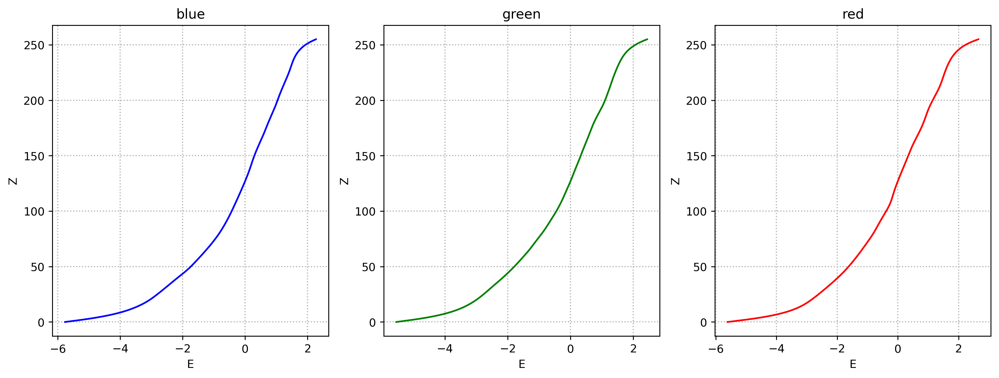

# VFX Project 1 - HDR Imaging

## Team Members
* B09902001 李奕辰
* B09902071 林峻毅

* Run

```
python3 hdr.py 
```
## It will use pictures in 'pictures' and output the radiance map, response cureve and result.hdr to 'hdr', and the tonemapping results to 'tonemapping'

# Works

## Image Alignment

### MTB methods

## HDR Reconstruction

### Debevecs methods (with lamdas = 10)

## Tone mapping

### local tonemapping methods in 2002

### global tonemapping methods in 2002

### global tonemapping methods in 2005

# Results
## Radiance map 
| Blue | Green | Red |
| :--------------------------: | :-------------------------: | :-------: |
|  |  |  |
## Response Curve

## tonemapping
| global_2002 | local_2002 | global_2005 |
| :--------------------------: | :-------------------------: | :-------: |
|  |  |  |
